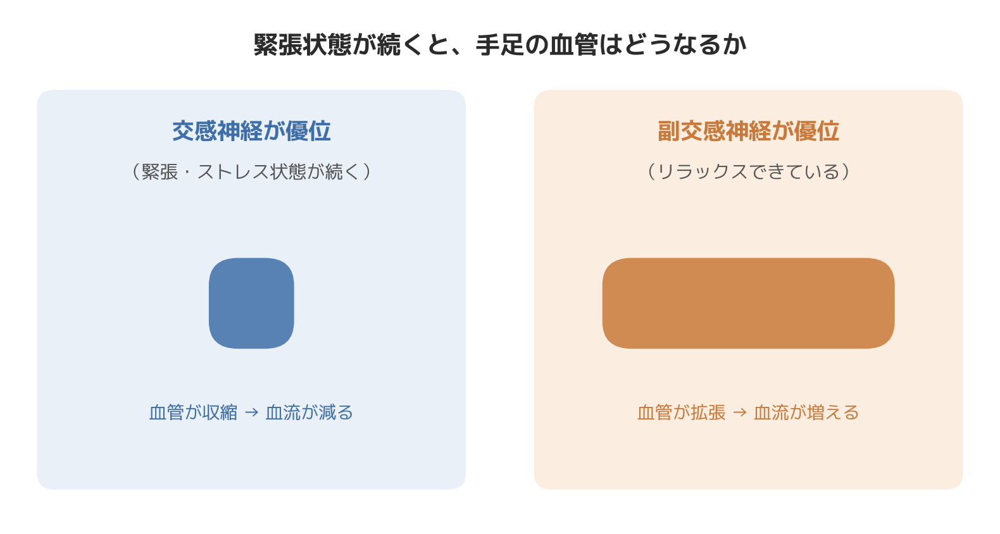
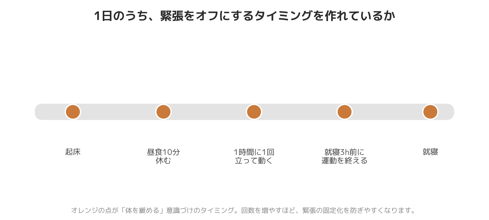

# 「冷え」によく聞かれる質問に整体師が答えます｜自律神経とのQ&A

先日、30代のオフィスワークの女性から「靴下を2枚重ねても、デスクワーク中はずっと足先が冷たいままなんです」という相談を受けました。話を聞いていくと、朝から晩まで座りっぱなし、納期前は昼食も5分で済ませる、帰宅後もスマホを見ながら緊張が抜けないまま就寝——という生活パターンが見えてきました。

この方に限らず、出張整体・パーソナルトレーニングの現場で「冷え」の相談を受けるとき、共通してあるクセに気づきます。それは、**体が「休んでいい」タイミングを一日のうちにほとんど作れていない**ということです。今日は、そうした現場感覚を踏まえながら、よくいただく質問にQ&A形式で答えていきます。

## Q1. 厚着をしても足先だけ冷たいのはなぜですか？

厚着は体の外側から熱を逃がさない対策であって、体の内側から血流を増やす対策ではありません。冒頭の相談者のように、緊張状態（交感神経優位）が続くと、体は手足の末端の血管を収縮させて、体の中心（内臓）を守ろうとします。これは寒さから身を守るための正常な反応ですが、慢性化すると「厚着しているのに指先だけ冷たい」という状態が固定化しやすくなります。

現場で触診すると、こういう方は決まって**肩甲骨の間から首の付け根にかけてが板のように硬い**ことが多いです。ここは自律神経の切り替えに関わる筋肉が集まっている部位で、ここが緩まないと、いくら手足を温めても根本的な冷えは変わりにくいというのが臨床上の実感です。

## Q2. 運動不足だと冷えやすいというのは本当ですか？

本当です。ふくらはぎは血液を心臓に送り返す「ポンプ」の役割を担っているため、座りっぱなしで筋肉を動かさない時間が長いほど、血流を押し戻す力そのものが弱まります。

ただ、現場で見ていて意外と多いのが「運動はしているのに冷える」ケースです。この場合、原因は筋肉量ではなく、**運動する時間帯そのもの**にあることがあります。夜遅くに強度の高いトレーニングをして交感神経を上げたまま就寝すると、体は「興奮モード」を引きずったまま眠りにつくことになり、かえって末端の血流回復が後回しになります。冷え対策としての運動は、量だけでなくタイミングも含めて考える必要があります。

## Q3. 整体やマッサージを受ければ冷えは改善しますか？

首・肩・骨盤まわりの緊張をゆるめ、血流が滞りやすい部位の可動域を広げることは、血流改善の一助になり得ます。ただし「施術を受けた直後だけ足が温かくなって、数日でまた元に戻る」という相談もよく受けます。

これは施術の効果が無いわけではなく、**日常生活で交感神経が優位になる時間の方が長ければ、体は元の状態に戻ろうとする**という、体の仕組み上ごく自然なことです。施術は「緩んだ状態を体験してもらう」入口であり、そこから先は生活の中でその状態を保つ工夫（休む時間の作り方、呼吸、軽い運動）が伴って、はじめて定着していきます。「必ず改善する」と保証はできませんが、体の状態を整える土台づくりとしては有効だと考えています。

## Q4. 女性の方が冷えを訴える方が多いのはなぜですか？

体質や筋肉量の違いに加えて、現場の体感として、**責任感が強く、自分のことを後回しにしやすい方ほど冷えを訴える傾向がある**と感じています。これは性別そのものというより、「常に何かに気を配っている」「休むことに罪悪感がある」という状態が続きやすいことと関係している可能性があります。緊張のスイッチが入りっぱなしになりやすい生活パターンが、結果として冷えという形で体に現れているケースを多く見てきました。

## 今日からできること

- 1時間に1回、30秒でいいので椅子から立ってふくらはぎを上下に動かす
- 昼食は「5分で終わらせる」のではなく、意識的に10分以上かけて座って食べる
- 夜のトレーニングは就寝の3時間前までに終える（どうしても遅くなる日は強度を落とす）
- 肩甲骨の間を、深呼吸に合わせて軽く開くストレッチを1日数回行う

## まとめ

冷えは「体質だから仕方ない」で片付けられがちですが、実際には「一日のうちに体を休ませる時間をどれだけ作れているか」が大きく関わっています。厚着や単発のケアだけでなく、緊張のスイッチを意識的にオフにする時間を生活に組み込んでいくことが、冷えと長期的に向き合う現実的な方法だと感じています。

─────────────

ここまで読んでくださった方へ

冷えや血流の悩みを、体の内側から見直したい方へ。
東京23区に出張する、パーソナルトレーニング×整体のSALUS（セラス）。
自律神経の視点から体を整えたい方は、公式HPから初回体験のご予約が可能です（現在、体験料・入会金無料キャンペーン中）。

→ 公式HP：https://w-salus.com/

---

### 推奨タグ
#自律神経 #整体 #冷え性 #肩こり #睡眠 #パーソナルトレーニング
