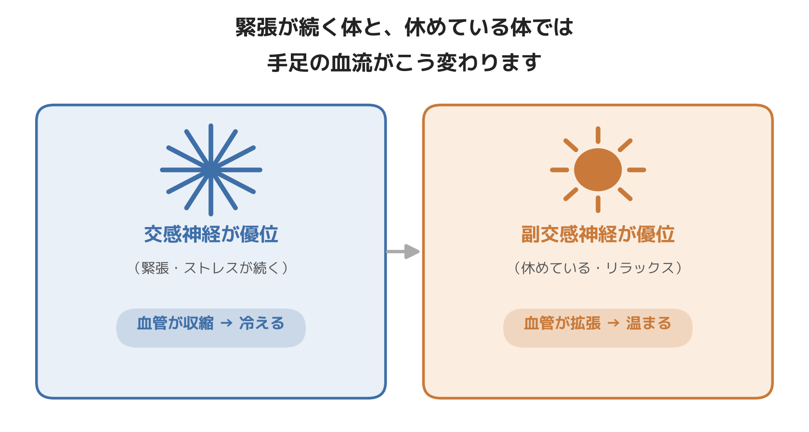

# 冷えを根本から見直す、科学的根拠つきの習慣4選

先日、30代のオフィスワークの女性から「靴下を2枚重ねても、デスクワーク中はずっと足先が冷たいままなんです」という相談を受けました。話を聞いていくと、朝から晩まで座りっぱなし、納期前は昼食も5分で済ませる、帰宅後もスマホを見ながら緊張が抜けないまま就寝——という生活パターンが見えてきました。

冷えの相談を受けるとき、共通してあるクセに気づきます。それは、**体が「休んでいい」タイミングを一日のうちにほとんど作れていない**ということです。今日は、そうした現場感覚をもとに、冷えに効く習慣を4つ、1つずつ試せる形でまとめました。全部やる必要はありません。気になったものから試してみてください。

─────────────

## 習慣①：肩甲骨の間を緩める

**やり方**
両肩を大きく後ろに回したあと、肩甲骨を背骨に寄せるように5秒キープ。これを5回。デスクワークの合間に。

**科学的根拠**
現場で触診すると、冷えを訴える方は決まって肩甲骨の間から首の付け根にかけてが板のように硬いことが多いです。ここは自律神経の切り替えに関わる筋肉が集まっている部位で、ここが緩まないと、いくら手足を温めても根本的な冷えは変わりにくいというのが臨床上の実感です。

## 習慣②：運動する時間帯を見直す

**やり方**
夜のトレーニングは就寝の3時間前までに終える。どうしても遅くなる日は強度を落とす。

**科学的根拠**
現場で見ていて意外と多いのが「運動はしているのに冷える」ケースです。この場合、原因は筋肉量ではなく、運動する時間帯そのものにあることがあります。夜遅くに強度の高いトレーニングをして交感神経を上げたまま就寝すると、体は「興奮モード」を引きずったまま眠りにつくことになり、かえって末端の血流回復が後回しになります。

## 習慣③：ふくらはぎを1時間に1回動かす

**やり方**
1時間に1回、30秒でいいので椅子から立ってふくらはぎを上下に動かす。かかとの上げ下げだけでも十分です。

**科学的根拠**
ふくらはぎは血液を心臓に送り返す「ポンプ」の役割を担っています。座りっぱなしで筋肉を動かさない時間が長いほど、この血流を押し戻す力そのものが弱まります。運動不足というより「動かす頻度」の問題であることが多く、まとめて運動するよりこまめに動く方が冷えには効きやすい印象です。

## 習慣④：昼食を10分以上かけて座って食べる

**やり方**
昼食は「5分で終わらせる」のではなく、意識的に10分以上かけて座って食べる。

**科学的根拠**
責任感が強く、自分のことを後回しにしやすい方ほど冷えを訴える傾向がある、と現場では感じています。常に何かに気を配っている状態が続くと、緊張のスイッチが入りっぱなしになりやすく、結果として冷えという形で体に現れているケースを多く見てきました。食事の時間を意識的に確保することは、1日の中に「休んでいい」タイミングを作る、一番手軽な方法の一つです。

─────────────

## まとめ

冷えは「体質だから仕方ない」で片付けられがちですが、実際には「一日のうちに体を休ませる時間をどれだけ作れているか」が大きく関わっています。4つ紹介しましたが、全部を完璧にこなす必要はありません。まずは1つ、今日から試してみてください。

ここまで読んでくださった方へ

冷えや血流の悩みを、体の内側から見直したい方へ。
東京23区に出張する、パーソナルトレーニング×整体のSALUS（セラス）。
自律神経の視点から体を整えたい方は、公式HPから初回体験のご予約が可能です（現在、体験料・入会金無料キャンペーン中）。

→ 公式HP：https://w-salus.com/

---

### 推奨タグ
#自律神経 #整体 #冷え性 #肩こり #睡眠 #パーソナルトレーニング
