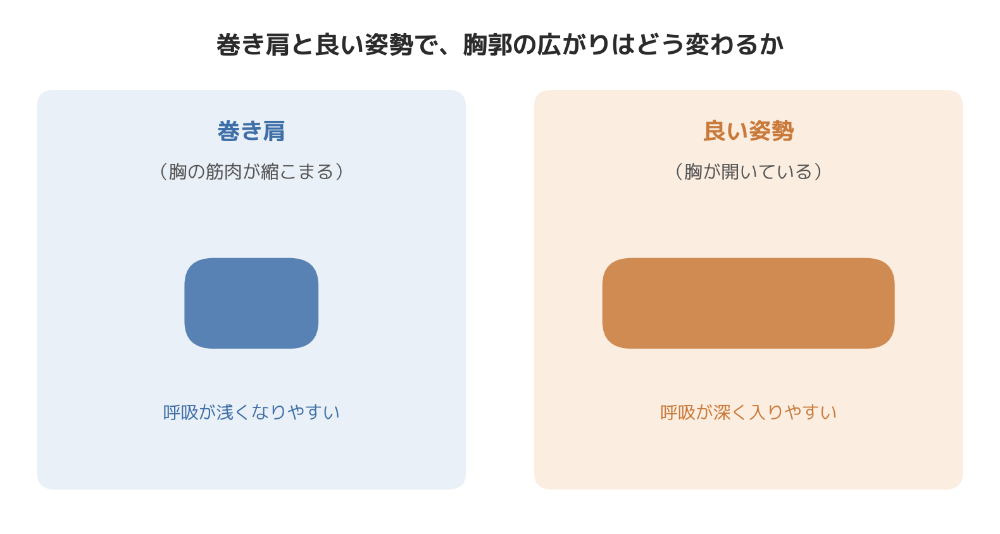

# 巻き肩を放置すると呼吸が浅くなる理由｜今日からできる自律神経を整えるケア

「肩が内側に入っているとよく言われる」「気づくとスマホを見る姿勢で肩が丸まっている」——巻き肩は見た目の印象だけの問題だと思われがちですが、実は呼吸の深さ、そして自律神経の状態にまで影響を及ぼすことがあります。

今日は理論の説明は最小限にして、今日から実践できる巻き肩対策を中心にお伝えします。まずは、なぜ巻き肩が自律神経に関係するのかを簡単に押さえておきましょう。

## 巻き肩がなぜ呼吸を浅くするのか

巻き肩の姿勢では、肩甲骨が外側に開き、胸の筋肉（大胸筋・小胸筋）が縮こまった状態になります。この状態が続くと、肺が入っている胸郭がしっかり広がりにくくなり、呼吸が浅くなりやすいと言われています。

呼吸が浅い状態が続くと、体を緊張させる交感神経が優位になりやすく、リラックスを担う副交感神経への切り替えが起こりにくくなる——というのが、姿勢と自律神経の関係として一般的に理解されているつながりです。巻き肩は「肩の見た目の問題」であると同時に、「呼吸のしやすさ」を通じて自律神経にも影響しうる姿勢だと考えられます。

現場で在宅ワークの方の体を見ていると、椅子に浅く座り、ノートパソコンの画面を覗き込むような姿勢を長時間続けている方ほど、この巻き肩と浅い呼吸のセットが強く出ている印象があります。オフィス勤務よりも姿勢を指摘してくれる人が周りにいない分、気づかないうちに固定化しやすいのかもしれません。

## 今日からできる巻き肩ケア5選

**1. 胸を開くストレッチ（1分）**
壁の角に手をつき、体を前に軽く倒して胸の前側（大胸筋）を伸ばします。デスクワークの合間に1〜2分行うだけでも、縮こまった胸まわりがゆるみやすくなります。

**2. 肩甲骨を寄せる運動（10回×2セット）**
肩をすくめずに、肩甲骨を背骨に寄せるようなイメージで後ろに引きます。巻き肩で使われにくくなっている背中側の筋肉を、意識的に働かせる運動です。

**3. 深呼吸をセットで行う**
胸を開くストレッチのあと、鼻からゆっくり息を吸い、口から長く吐き出す深呼吸を3〜5回行います。呼吸を深くすることで、姿勢のケアと自律神経のケアを同時に行うイメージです。

**4. スマートフォンの位置を見直す**
画面を目の高さに近づけるだけで、首・肩が前に引っ張られる姿勢を減らせます。「気づいたら画面を持ち上げる」を習慣にしてみてください。

**5. 1時間に1回、姿勢をリセットする合図を作る**
タイマーやアプリの通知を使って、1時間に1回、胸を開いて深呼吸するタイミングを強制的に作ると、意識しなくても続けやすくなります。

## 続けるためのコツ

一度に完璧を目指すと続きません。「今日は胸のストレッチだけ」「今日は深呼吸だけ」というように、5つのうち1つでもできた日は良しとする感覚で取り組む方が、結果的に長続きしやすい傾向があります。

## まとめ

巻き肩は放置すると、見た目の印象だけでなく、呼吸の深さ、ひいては自律神経のバランスにも影響しうる姿勢です。ただし、根性で「姿勢を正そう」とし続けるのは疲れてしまいます。今日紹介したような小さなケアを、生活の中に自然に組み込んでいくことが、無理なく続けるコツです。効果には個人差がありますが、まずは1週間、できる範囲で試してみてください。

─────────────

ここまで読んでくださった方へ

巻き肩や姿勢の崩れを、呼吸・自律神経の視点から根本的に見直したい方へ。
東京23区に出張する、パーソナルトレーニング×整体のSALUS（セラス）。
姿勢・体の使い方から整えたい方は、公式HPから初回体験のご予約が可能です（現在、体験料・入会金無料キャンペーン中）。

→ 公式HP：https://w-salus.com/

---

### 推奨タグ
#自律神経 #整体 #巻き肩 #姿勢改善 #肩こり #パーソナルトレーニング
