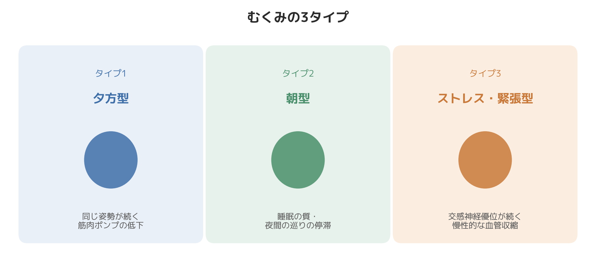

# あなたのむくみはどのタイプ？自律神経から考える3タイプ診断

「夕方になると足がパンパンになる」「朝起きると顔がむくんでいる」——むくみの悩みは多くの方が抱えていますが、実はむくみが出やすいタイミングや部位によって、背景にある原因は少しずつ異なります。

以前、年収帯も高く仕事にも真剣に向き合っている30代の女性の会員さまで、「マッサージに行っても翌日にはむくみが戻ってしまう」と相談されたことがあります。話を聞くと、むくみは季節や食事に関係なく一年中あり、同時に肩こりと冷えも抱えていました。マッサージそのものは間違っていなかったのですが、根本の緊張状態にアプローチできていなかったために、効果が長続きしていなかったのだと思います。

出張整体・パーソナルトレーニングの現場で多くの方の体を見てきた経験から、むくみを自律神経の視点で3つのタイプに分けて整理してみます。ご自身がどのタイプに近いか、当てはめながら読んでみてください。

## むくみの基本的な仕組み

むくみは、血管から染み出た水分が、静脈やリンパによって回収しきれずに組織にたまってしまう状態です。血液を心臓に戻す「静脈還流」は、ふくらはぎなどの筋肉のポンプ作用によって支えられていますが、この血管の収縮・拡張そのものは自律神経によっても調整されています。交感神経が優位な状態が続くと血管が収縮しやすくなり、血流が滞ってむくみにつながりやすいと考えられています。

この前提を踏まえて、3つのタイプを見ていきましょう。

## タイプ1：夕方型（同一姿勢・筋肉ポンプ低下タイプ）

**特徴**：朝はスッキリしているが、夕方になるにつれて足がパンパンになる。デスクワークや立ち仕事で長時間同じ姿勢を取ることが多い。

**背景**：長時間同じ姿勢が続くと、ふくらはぎの筋肉が動かず、血液を押し戻すポンプ機能が働きにくくなります。重力の影響もあり、水分が下半身に滞留しやすくなるタイプです。

**対策の方向性**：こまめに立つ・歩く、ふくらはぎを動かすなど、筋肉ポンプを働かせる機会を増やすことが基本になります。

## タイプ2：朝型（自律神経・睡眠関連タイプ）

**特徴**：朝起きたときに顔や指がむくんでいる。日中はそれほど気にならないが、寝起きの状態が気になる。

**背景**：睡眠の質が低い、就寝前まで交感神経が優位な状態が続いている場合、夜間の血流やリンパの循環が滞りやすくなり、朝のむくみとして現れやすいと考えられます。寝る姿勢や塩分の摂りすぎが重なると、さらに出やすくなります。

**対策の方向性**：就寝前にリラックスする時間を作り、副交感神経が優位になりやすい状態で眠りに入ることがポイントになります。

## タイプ3：ストレス・緊張型（交感神経優位タイプ）

**特徴**：時期や体調に関わらず、慢性的にむくみやすい。肩こりや冷えなど、他の不調も併せて感じている。

**背景**：日常的に緊張状態が続き、交感神経が優位になりやすい方は、血管が収縮しやすい状態が続くため、全身的に血流が滞りやすくなります。むくみが単独ではなく、冷え・肩こり・だるさとセットで出てくることが多いのが特徴です。

**対策の方向性**：一時的な対症療法よりも、緊張状態そのものを緩める習慣（深呼吸、施術によるケアなど）が根本的なアプローチになります。冒頭でご紹介した会員さまも、このタイプに近い状態でした。マッサージ単体ではなく、日常の中で緊張が抜けるタイミングを意識的に作るようにしてもらったところ、むくみが「戻りにくく」なっていきました。

## 今日からできること（共通）

- 30分に1回、軽く立つ・かかとの上げ下げをする
- 就寝1時間前はスマートフォンやパソコンから離れ、照明を落とす
- 塩分の摂りすぎに気をつけつつ、水分はこまめに取る
- 気になる部位（ふくらはぎ・首肩）を軽くセルフマッサージする

## まとめ

むくみは「体質だから仕方ない」と諦められがちですが、いつ・どこにむくみが出やすいかを観察すると、背景にある生活習慣や自律神経の状態が見えてきます。ご自身のタイプを知り、それに合った対策を積み重ねることが、慢性的なむくみと向き合う近道になります。個人差はあるため、症状が強い場合や急なむくみが続く場合は、念のため医療機関への相談も検討してください。

─────────────

ここまで読んでくださった方へ

むくみや巡りの悩みを、体の内側から見直したい方へ。
東京23区に出張する、パーソナルトレーニング×整体のSALUS（セラス）。
自律神経の視点から体を整えたい方は、公式HPから初回体験のご予約が可能です（現在、体験料・入会金無料キャンペーン中）。

→ 公式HP：https://w-salus.com/

---

### 推奨タグ
#自律神経 #整体 #むくみ #冷え性 #肩こり #パーソナルトレーニング
