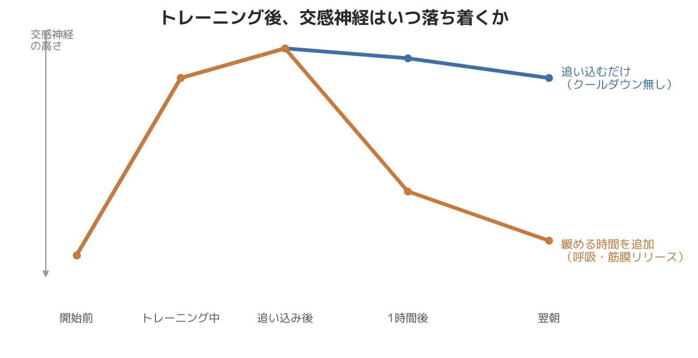

# 運動しても疲れが抜けないのはなぜか｜トレーニングと自律神経の関係を整体師が解説

「運動した日ほど、逆に疲れが抜けない気がする」

以前担当していた30代男性の会員さまで、大会出場に向けて毎日欠かさずハードなトレーニングを積んでいた方がいました。追い込めば追い込むほど体は仕上がっていくはずなのに、大会が近づくにつれて逆に「朝起きても疲れが取れない」「トレーニング中も体が重い」と口にすることが増えていきました。フォームや重量設定に問題はなく、むしろ真面目に追い込みすぎていたことが、後から振り返ると原因の一つでした。

こうした「運動しているのに、むしろ疲れが抜けない」という相談は、パーソナルトレーニングの現場で珍しくありません。今日は柔道整復師・パーソナルトレーナーとして8年以上、体づくりの現場に立ってきた立場から、「運動と疲労回復」の関係を自律神経の視点から整理してお話しします。運動そのものが悪いのではなく、「運動の質」と「自律神経の状態」がかみ合っていないことが原因になっているケースが多いというのが、現場で見えてきた実感です。

## 運動は本来、自律神経を整える手段になり得る

身体活動や運動がメンタルヘルスや生活の質の改善に寄与することはよく知られています。運動には血流を促進し、心拍や呼吸のリズムを通じて自律神経の働きを整えていく側面があります。

自律神経には、活動時に優位になる交感神経と、休息・回復時に優位になる副交感神経があり、通常はこの2つが状況に応じて切り替わりながらバランスを取っています。適度な運動は、日中に交感神経をしっかり働かせることで、夜にかけて副交感神経へスムーズに切り替わりやすくする効果が期待できる、というのが一般的に理解されている仕組みです。

## それでも「疲れが抜けない」が起こる理由

では、なぜ運動しているのに疲れが取れないという相談が後を絶たないのでしょうか。現場で見えてきたパターンは、大きく3つに分けられます。

**1. 交感神経が「入りっぱなし」になっている**
仕事のストレス、睡眠不足、スマートフォンの使いすぎなどで、そもそも普段から交感神経が優位になりやすい状態の方が、そこに強度の高い運動を重ねると、交感神経がさらに刺激され、副交感神経への切り替えが起こりにくくなることがあります。運動後にしっかり呼吸を整え、クールダウンする時間を取らないと、体が「興奮したまま」になりやすいのです。

**2. 運動強度と回復力が見合っていない**
日々の疲労が蓄積した状態で、追い込むトレーニングを続けると、体を修復する時間よりも負荷をかける時間の方が上回ってしまいます。特に自己流でトレーニングをしている方に多いのが、「もっと追い込まなければ」という思考で、休息を後回しにしてしまうパターンです。

**3. 運動後のケアが自律神経の切り替えを妨げている**
運動直後にすぐスマートフォンを見る、強い光を浴び続ける、カフェインを摂るといった行動は、せっかく体を動かしても交感神経を保ったままにしてしまいます。運動そのものより、運動後の過ごし方が疲労回復を左右していることは意外と見落とされがちです。

## 「緩める」「整える」を組み合わせたトレーニング設計

先ほどの会員さまの場合、トレーニングの負荷そのものは変えず、**トレーニング後半に筋膜リリースと呼吸だけのクールダウンを5分追加した**ところ、2週間ほどで「朝の重さが減った」と変化を口にされるようになりました。負荷を落としたわけではなく、交感神経が上がりっぱなしだった時間に「下げる工程」を足しただけです。

これは研究データというより、8年間現場で見てきた経験則としてお伝えするものですが、筋膜リリースや呼吸を意識したウォームアップ・クールダウンを取り入れることで、「動いた後にしっかり回復できる」という声を多くいただいています。

## 今日からできること

- トレーニングの最後に、3〜5分ほど深い呼吸に意識を向けるクールダウンの時間を作る
- 運動直後はスマートフォンやSNSから少し距離を置き、照明を落として過ごす
- 「毎回追い込む」のではなく、週の中で強度に緩急をつける
- 運動前後に軽いストレッチや筋膜リリースを取り入れ、緊張をリセットする

## まとめ

運動しても疲れが抜けないという状態は、運動をやめるべきサインではなく、「運動の組み立て方」や「自律神経の切り替え方」を見直すサインであることが多いです。追い込むトレーニングと、緩めて整える時間、その両方をバランスよく取り入れることで、体は本来の回復力を取り戻していきます。個人差はありますが、まずは自分の体が今どちらに偏っているのかを知ることから始めてみてください。

─────────────

ここまで読んでくださった方へ

「運動しているのに疲れが抜けない」を根本から見直したい方へ。
東京23区に出張する、パーソナルトレーニング×整体のSALUS（セラス）。
自律神経の視点から体を整えたい方は、公式HPから初回体験のご予約が可能です（現在、体験料・入会金無料キャンペーン中）。

→ 公式HP：https://w-salus.com/

---

### 推奨タグ
#自律神経 #整体 #パーソナルトレーニング #肩こり #睡眠 #疲労回復
