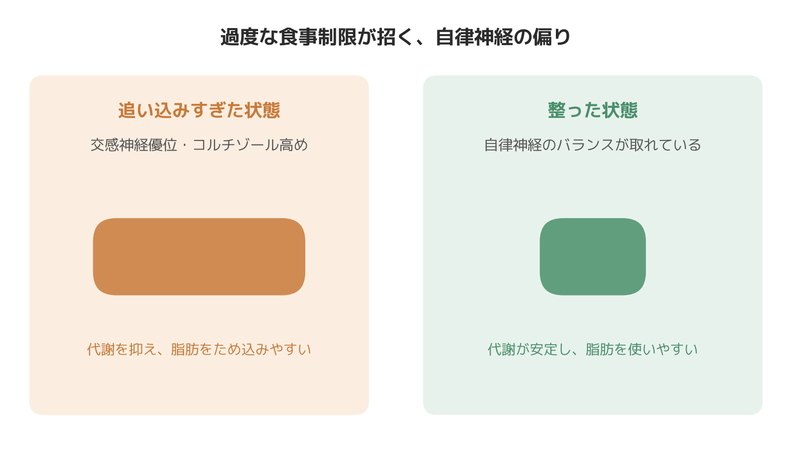

# ダイエットが続かない・停滞するのはなぜか｜自律神経とストレスホルモンから見る代謝の仕組み

「最初の2週間は面白いように体重が落ちたのに、3週目あたりからぴたっと止まった」「食事を減らしているのに、むしろ甘いものへの欲求が強くなってやめられない」——出張パーソナルトレーニングの現場では、こうした相談を本当によく受けます。

先日担当した30代・営業職の女性Tさんも、まさにこのパターンでした。忙しい仕事の合間を縫って昼食を抜き気味にし、夜は遅くまで仕事をして睡眠は5時間程度という生活。最初の2週間で体重は順調に落ちたものの、3週目あたりから数字がぴたりと動かなくなり、同時に「甘いものを無性に欲しくなる」「朝起きるのがつらい」という訴えが増えていきました。似たような経過をたどる方は、性別や年代を問わず少なくありません。

これは意志の弱さの問題というより、自律神経とストレスホルモンが関わる、ある程度説明のつく体の反応である可能性があります。今日は柔道整復師・パーソナルトレーナーとして体の仕組みを扱ってきた立場から、「ダイエットが続かない」「停滞する」というテーマを、自律神経と代謝の視点から掘り下げてみます。

## 「頑張りすぎ」が交感神経を優位にする

食事制限や強度の高い運動を続けると、体にとっては一種のストレス状態として扱われることがあります。ストレスを受けると、副腎から「コルチゾール」というホルモンが分泌されることが知られています。コルチゾールは本来、血糖値を保ちエネルギーを作り出すための重要なホルモンで、適度な範囲であれば日々の活動に欠かせないものです。

ただし、過度な食事制限や慢性的な睡眠不足といったストレスが続くと、コルチゾールの分泌が高止まりしやすくなると言われています。コルチゾールが慢性的に高い状態が続くと、筋肉のたんぱく質が分解されやすくなる一方で、内臓まわりに脂肪がつきやすい方向に働くとされており、「体重は落ちにくいのに、お腹まわりだけぽっこりしてくる」という状態につながることがあります。

このコルチゾールの分泌をコントロールしているのが自律神経です。自律神経には、体を活動モード・緊張モードにする交感神経と、休息・回復モードにする副交感神経があり、通常はこの2つがバランスを取りながら働いています。過度な食事制限や寝不足、仕事のプレッシャーが重なると交感神経が優位な状態が続きやすくなり、体は「エネルギーを使うより、ためておこう」という方向に傾きやすくなる、というのが生理学的に理解されている仕組みです。

## 基礎代謝と自律神経の関係

基礎代謝、つまり何もしなくても消費されるエネルギーの大きな部分は、筋肉量と、自律神経が関わる熱産生のしくみに支えられています。体温を保つために体の内部で熱を作り出す働きは交感神経を介してコントロールされており、寒いときに体が震えたり血管が収縮したりするのも、この仕組みの一部です。

ところが、極端な食事制限が続くと、体は「エネルギーが足りない状態」だと判断し、消費エネルギーそのものを抑えて省エネモードに切り替えようとする反応が起こることが知られています。これがいわゆる「停滞期」の正体の一つと考えられています。同じ食事量・運動量を続けているのに、ある時期から体重が動かなくなるのは、サボっているからではなく、体が環境に適応しようとした結果である可能性が高いのです。

さらに、筋肉量が落ちると基礎代謝そのものが下がりやすくなるため、無理な食事制限だけで乗り切ろうとするダイエットは、長期的にはかえって停滞を招きやすい方向に働きます。

## 睡眠不足が食欲ホルモンを狂わせる

もう一つ見逃せないのが、睡眠と食欲ホルモンの関係です。睡眠が不足すると、満腹感に関わる「レプチン」というホルモンの分泌が減り、反対に空腹感を強める「グレリン」というホルモンの分泌が増えることが報告されています。つまり寝不足の状態では、同じ量を食べても満腹を感じにくく、なおかつお腹が空きやすくなるという、ダイエットには不利な条件が体の中でつくられてしまうわけです。

「ダイエット中なのに、夜になると甘いものが止まらない」という相談をよく受けますが、これは意志の弱さというより、睡眠不足や過度なストレスによって自律神経とホルモンバランスが崩れ、脳が「エネルギーを早く確保しなさい」という指令を出しやすくなっている状態だと捉えると、多くの方が「自分を責めなくていいんだ」と少し楽になるようです。

## 施術の現場で見えてきたこと

8年間、整体とパーソナルトレーニングの両方の現場に立ってきて感じるのは、「ダイエットが続かない」と話す方の多くが、肩や首、みぞおち周りの筋肉が慢性的に緊張しているということです。過度な食事制限をしている方ほど、触診したときに体が常に身構えているような硬さを持っていることが多いというのが、現場での率直な実感です。トレーニング指導と触診の両方を行っているからこそ気づくのですが、こうした緊張が強い方ほど運動量を増やしても思うように体重が落ちていかない傾向があります。体が常に交感神経優位の緊張状態にあり、休むべきタイミングでもうまく休めていないことが、背景にあるのではないかと感じています。

## 今日からできる実践

- **食事を減らしすぎない**：極端なカロリー制限よりも、たんぱく質を中心に必要な栄養は確保しながら緩やかな赤字をつくるほうが、長期的には継続しやすく停滞も起こりにくいと言われています。
- **睡眠時間を見直す**：睡眠不足は食欲ホルモンのバランスを崩しやすいため、「ダイエット中こそ睡眠時間を削らない」という発想の転換が大切です。
- **停滞期を「失敗」と捉えない**：体重が動かない時期は、体がエネルギー不足に適応しようとしているサインの可能性があります。同じ生活を淡々と継続することで、再び体重が動き出すケースも少なくありません。
- **呼吸と休息を意識的に挟む**：1日の中に数分でも深呼吸やストレッチの時間をつくり、副交感神経が働く時間を意図的に確保することも、自律神経のバランスを整える助けになります。

## まとめ

「ダイエットが続かない」「停滞する」という悩みは、気合や根性の問題ではなく、自律神経とストレスホルモン、そして食欲ホルモンが関わる、体の防御反応として起こっている部分が少なくありません。無理な制限で自律神経を乱すよりも、睡眠や休息を含めた生活全体を整えることが、遠回りに見えて実は停滞を抜け出す近道になることがあります。体の反応には個人差があり、すべての停滞がこの仕組みだけで説明できるわけではありませんが、「頑張っているのに結果が出ない」ときほど、一度立ち止まって自律神経の状態を見直してみる価値はあるはずです。

─────────────

ここまで読んでくださった方へ

「頑張っているのに停滞する」を自律神経の視点から見直したい方へ。
東京23区に出張する、パーソナルトレーニング×整体のSALUS（セラス）。
自律神経の視点から体を整えたい方は、公式HPから初回体験のご予約が可能です（現在、体験料・入会金無料キャンペーン中）。

→ 公式HP：https://w-salus.com/

---

### 推奨タグ
#自律神経 #整体 #肩こり #睡眠 #パーソナルトレーニング #ダイエット #停滞期
