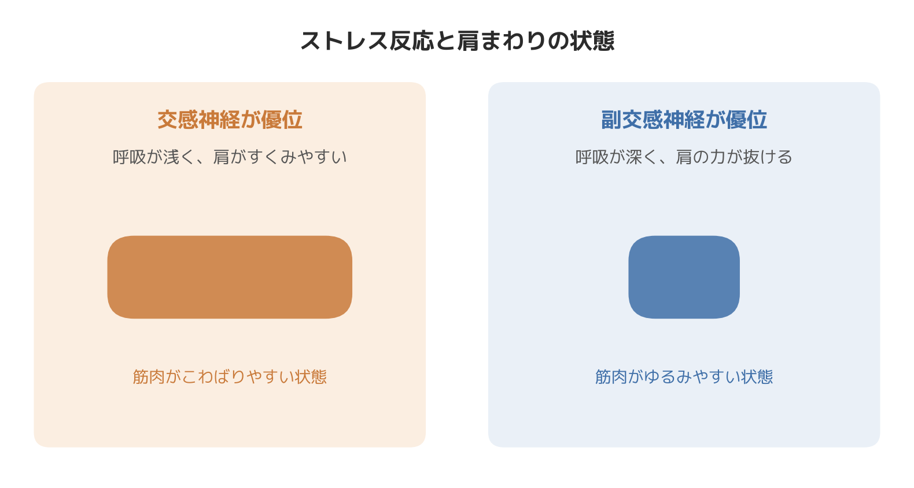
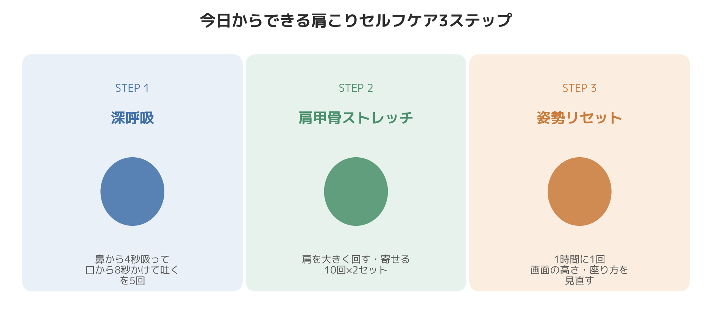

# その肩こり、今日から変わる。自律神経を整えるセルフケア実践ガイド

先日担当した、デスクワーク中心の30代男性の方のお話です。「肩こりがひどくて、毎週マッサージに通っているけれど、その場限りですぐ元に戻ってしまう」とのことでした。実際に体を触らせていただくと、僧帽筋の上の方がカチカチに張っていて、呼吸をしてもらうと胸の上の方しか動いておらず、呼吸が驚くほど浅い状態でした。

肩こりというと「肩の筋肉が硬くなっている」というイメージが強いと思いますが、実はその背景に、呼吸の浅さや自律神経の状態が関わっていることが少なくありません。今日は理論の説明は最小限にして、今日から実践できるセルフケアを中心にお伝えします。

## なぜ肩こりと自律神経が関係するのか（要点だけ）

長時間のデスクワークや精神的なストレスが続くと、体を緊張モードに切り替える交感神経が優位になりやすいと言われています。交感神経が優位な状態が続くと、筋肉は常に力を入れた状態になりやすく、首・肩まわりの血流も滞りやすくなることが知られています。

さらに、ストレスや緊張で呼吸が浅くなると、本来は呼吸の補助的な役割である首・肩の筋肉（僧帽筋など）を使って息を吸うようになり、肩まわりが常に緊張した状態になりやすいと言われています。「呼吸が浅い→肩に力が入る→肩こりが悪化する→さらに呼吸が浅くなる」という悪循環が起きやすいのは、このためです。

つまり、肩こりのセルフケアは「肩そのもの」だけでなく、「呼吸」と「自律神経の切り替え」を意識することで、アプローチの幅が広がります。マッサージやストレッチで一時的に筋肉がゆるんでも、浅い呼吸のパターンや交感神経優位の状態がそのままだと、またすぐに肩まわりが緊張し直してしまう——というのは、現場でよく見かける流れです。ここから先は、理論よりも実践を中心にお伝えします。

## 今日からできる肩こりセルフケア3ステップ

### STEP1：深呼吸で副交感神経を優位にする（1〜2分）

1. 背筋を軽く伸ばして座る、または立つ
2. 鼻からゆっくり4秒かけて息を吸う（お腹が膨らむのを感じながら）
3. 口をすぼめて、8秒かけてゆっくり吐き切る
4. これを5回繰り返す

ポイントは「吸う」より「吐く」時間を長くすることです。ゆっくり長く息を吐く呼吸は副交感神経を優位にしやすいと言われています。肩の力が抜けている感覚を確認しながら行ってください。

息を吸うときに肩が持ち上がってしまう方は、胸ではなくお腹を膨らませる意識で吸うと、首・肩の呼吸補助筋に頼らずに吸いやすくなります。最初はうまくできなくても問題ありません。回数を重ねるうちに感覚がつかめてくることが多いです。

### STEP2：肩甲骨まわりをゆるめるストレッチ（3分）

**肩回し**
1. 両手の指先を肩に軽く置く
2. 肘で大きな円を描くように、肩を前から後ろへ10回回す
3. 同じく後ろから前へ10回回す

**肩甲骨寄せ**
1. 肩をすくめずに、肩甲骨を背骨に寄せるイメージで両肩を後ろに引く
2. 2秒キープしてゆっくり戻す
3. これを10回×2セット

肩甲骨まわりの筋肉を動かすことで血流が促されやすく、こり固まった筋肉がゆるみやすくなると言われています。デスクワークの合間、1〜2時間に1回を目安に行うのがおすすめです。立ち上がれない会議中や電車の中でも、肩をすくめずに軽く上下させるだけで、やらないよりは血流の滞りを防ぎやすくなります。

### STEP3：姿勢をリセットする習慣をつくる

1. モニターや画面の上端を目線の高さに合わせる（覗き込む姿勢を防ぐ）
2. 椅子には深く腰掛け、骨盤を立てるように座る
3. スマートフォンを見るときは、画面を目の高さまで持ち上げる
4. タイマーやアプリの通知を使い、1時間に1回「STEP1の深呼吸+STEP2の肩回し」をセットで行うタイミングを強制的につくる

姿勢を「ずっと正しく保つ」のは現実的ではありません。大事なのは、崩れた姿勢を定期的にリセットする仕組みを生活の中に組み込むことです。

## 続けるコツ：完璧を目指さない

冒頭の30代男性の方には、まずSTEP1の深呼吸だけを、仕事の合間に意識してもらうようお伝えしました。数週間後にお会いしたときには「肩の重さが続く時間が短くなった気がする」とのお話をいただきましたが、効果の感じ方には個人差があり、全員に同じ変化が起きるとは限りません。あくまで一つの経験としてお伝えしています。

3つのステップを全部やろうとすると続きません。「今日は深呼吸だけ」「今日は肩回しだけ」のように、どれか1つでもできた日は良しとする感覚で取り組む方が、結果的に習慣として定着しやすい印象です。

## 現場で感じること

8年間、整体とパーソナルトレーニングの両方の現場で体を見てきた中で感じるのは、肩こりを訴える方の多くが、肩そのものよりも先に呼吸のパターンに特徴が出ているということです。触診で肩まわりの張りを確認する前に、まず胸の上の方だけが上下する浅い呼吸をしているかどうかを見ると、その方の肩こりの背景がある程度見えてくる、というのが臨床上の実感です。肩だけを揉んでも呼吸のパターンが変わらなければ、こりが戻ってきやすいのは、こうした背景があるからだと感じています。

## まとめ

肩こりは「肩の筋肉の硬さ」だけでなく、呼吸の浅さや自律神経のバランスとも関係が深いと考えられています。今日紹介した深呼吸・肩甲骨ストレッチ・姿勢リセットの3ステップは、どれも1〜3分でできる内容です。すべてを完璧にこなす必要はありません。まずは1つだけ、今日から試してみてください。効果の感じ方には個人差がありますので、ご自身の体の変化を観察しながら、無理のない範囲で続けていただければと思います。

─────────────

ここまで読んでくださった方へ

肩こりを、肩そのものだけでなく自律神経の視点から根本的に見直したい方へ。
東京23区に出張する、パーソナルトレーニング×整体のSALUS（セラス）。
自律神経の視点から体を整えたい方は、公式HPから初回体験のご予約が可能です（現在、体験料・入会金無料キャンペーン中）。

→ 公式HP：https://w-salus.com/

---

### 推奨タグ
#自律神経 #整体 #肩こり #睡眠 #パーソナルトレーニング #呼吸法 #肩甲骨ストレッチ
