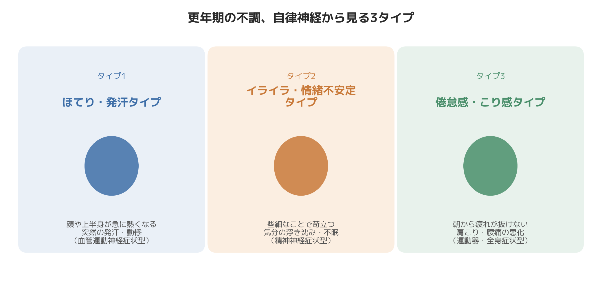

# 更年期の不調、あなたはどのタイプ？自律神経から考える3タイプ診断

「夜中に急に汗だくになって目が覚める」「些細なことに苛立って、自分でも戸惑う」「以前なら平気だったことで、やたら疲れが抜けない」——更年期の不調は、ご本人が一番戸惑うものだと感じています。

以前、40代後半で管理職として忙しく働く女性の会員さまから、「夜中に突然暑くなって目が覚め、気づけばパジャマが汗でぐっしょりしている」とご相談いただいたことがあります。日中は特に体調が悪いわけではないのに、夜だけ急に体温のスイッチが入ったように感じる、とのことでした。お話を伺っていくうちに、肩や首の張りが以前より強くなっていることや、些細なことでイライラしてしまう自覚もあわせて出てきました。

このように、更年期の不調は人によって出方が大きく異なります。実はこのテーマ、更年期世代のご本人だけでなく、同世代のご家族（お母様やお姉様など）の話題としても気になる方が多いように感じます。今回は、更年期特有の不調を自律神経の視点から3つのタイプに分けて整理してみます。ご自身や身近な方に当てはまるタイプがないか、確認しながら読んでみてください。

## 更年期の不調はなぜ起こるのか

更年期とは、閉経の前後およそ5年間を指す期間で、この時期に現れるさまざまな体調の変化のうち、日常生活に支障が出るほどのものを更年期障害と呼びます。

その背景にあるのが、卵巣から分泌されるエストロゲン（女性ホルモン）の変化です。エストロゲンは20〜30代でもっとも多く分泌され、40歳前後から徐々に減り始め、閉経の前後で急激に落ち込みます。

ここで重要なのが、エストロゲンの分泌をコントロールしているのが、脳の「視床下部」という部分だということです。視床下部は卵巣に対して「ホルモンを作るように」と指令を出す役割を持つと同時に、体温調整・呼吸・心拍など、自律神経の働き全体を統括する中枢でもあります。

卵巣の機能が低下してくると、視床下部がいくら指令を出しても卵巣側がうまく応えられない状態が続きます。この指令と応答のズレが積み重なることで視床下部そのものの働きが揺らぎ、本来は別の機能であるはずの自律神経の調整にまで影響が及んでいく、という仕組みが更年期の不調の背景にあると言われています。ほてりや発汗（ホットフラッシュ）についても、この視床下部の体温調節機能が過敏になり、通常なら汗をかくほどではないわずかな体温の変化にまで過剰に反応してしまうことが関係していると考えられています。

つまり更年期の不調は、気合いや性格の問題ではなく、ホルモンと自律神経という体の仕組み上、起こるべくして起こっている反応だと言えます。この前提を踏まえて、3つのタイプを見ていきましょう。

## 更年期の不調、3つのタイプ

### タイプ1：ほてり・発汗タイプ（血管運動神経症状型）

**特徴**：顔や上半身が急にカッと熱くなる、突然汗が止まらなくなる、逆に手足は冷える、動悸や息切れを感じることがある。

**背景**：エストロゲンの減少によって視床下部の体温調整機能が敏感になり、交感神経が急に優位になることで血管が拡張し、のぼせや発汗という形で現れやすいタイプです。日中だけでなく就寝中に症状が出て、睡眠そのものが妨げられるケースも少なくありません。

### タイプ2：イライラ・情緒不安定タイプ（精神神経症状型）

**特徴**：些細なことでイライラする、気分が沈みやすい、寝つきが悪い・眠りが浅い、頭痛やめまいを感じやすい。

**背景**：自律神経は本来、気分や感情の波とも密接に関わっている仕組みです。エストロゲンの変動が自律神経のバランスを揺らがせることで、交感神経と副交感神経の切り替えがスムーズにいかなくなり、感情の波や睡眠の質の低下として現れやすいタイプです。

### タイプ3：倦怠感・こり感タイプ（運動器・全身症状型）

**特徴**：朝から疲れが抜けない、肩こり・腰痛が以前より強く出る、体がだるくて動くのが億劫に感じる。

**背景**：自律神経の乱れが続くと、全身の血流や筋肉の緊張状態にも影響が及びます。慢性的に交感神経優位の状態が続くことで筋肉がこわばりやすくなり、疲労感やこりという形で蓄積していくタイプです。冒頭でご紹介した会員さまも、このタイプの要素を併せ持っていました。

実際には、これらのタイプは独立しているわけではなく、複数が重なって出ることも多いというのが臨床上の実感です。ご自身の中で「一番強く出ている」ものがどれかを意識してみるくらいで十分です。

## 施術の現場で感じること

8年間、整体とパーソナルトレーニングの両方で体を見てきた中で感じるのは、更年期世代の方の多くが、肩こりや腰痛を「年のせい」「疲れのせい」として片付けてしまっていることです。実際に触診をすると、首の付け根から肩甲骨にかけての深層の筋肉が以前よりも明らかに硬く、かつ左右差が出ているケースが多いという印象を持っています。これは単なる使いすぎではなく、自律神経の乱れによって筋肉の緊張が抜けにくくなっているサインだと捉えています。体を動かしながら筋肉を緩める施術を組み合わせると、こり感や疲労感が軽くなったと感じていただけることが多い、というのが現場での実感です。

## 今日からできる、自律神経を整える工夫

タイプに関わらず、自律神経の過度な緊張を緩めることは共通して役立つ土台になります。

- **就寝前1時間はスマートフォン・パソコンから離れる**：交感神経を刺激する光や情報を減らし、副交感神経が優位になりやすい状態を作ります。
- **鼻からゆっくり長く吐く呼吸を1日数回取り入れる**：呼吸はほぼ唯一、自分の意思で自律神経に働きかけられる入り口です。
- **軽い有酸素運動や筋力トレーニングを習慣にする**：体を適度に動かすことは血流を促し、自律神経の切り替えをスムーズにする土台づくりに役立つと感じています。
- **肩甲骨まわり・首まわりを意識的に動かす**：こり感タイプの方は特に、同じ姿勢が続くことで症状が強まりやすいため、こまめに姿勢を変えることを意識してください。

ただし、症状の強さや感じ方には大きな個人差があります。日常生活に支障が出るほどの不調が続く場合は、自己判断で抱え込まず、婦人科などの医療機関にご相談いただくことをおすすめします。更年期障害には医療機関での治療の選択肢もありますので、専門医の診断を受けることが何より確実な一歩になります。

## まとめ

更年期の不調は、エストロゲンの減少が視床下部を通じて自律神経に影響を与えることで起こる、体の仕組み上自然な反応です。ほてり・発汗、イライラ・情緒不安定、倦怠感・こり感と、現れ方は人によって異なりますが、根っこにあるのは同じ自律神経の揺らぎだと捉えると、対処の方向性も見えやすくなります。個人差は大きいため、ご自身やご家族の状態に強い不調がある場合は、婦人科などの専門医療機関への相談も選択肢に入れながら、無理なく整えていく習慣を積み重ねていただければと思います。

─────────────

ここまで読んでくださった方へ

更年期世代の自律神経の揺らぎを、体の外側からも整えていきたい方へ。
東京23区に出張する、パーソナルトレーニング×整体のSALUS（セラス）。
自律神経の視点から体を整えたい方は、公式HPから初回体験のご予約が可能です（現在、体験料・入会金無料キャンペーン中）。

→ 公式HP：https://w-salus.com/

---

### 推奨タグ
#自律神経 #整体 #肩こり #睡眠 #パーソナルトレーニング #更年期
