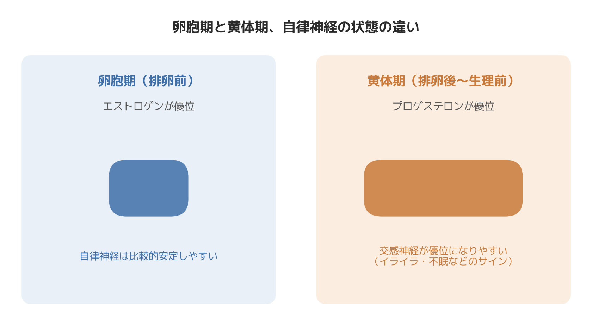

# 生理前のイライラ、気のせいじゃない。PMS・生理不順と自律神経の関係｜よくある質問Q&A

整体の現場で、生理前後の体調の話になると、堰を切ったように悩みを打ち明けてくださる方が少なくありません。「生理前になると自分でも制御できないくらいイライラしてしまう」「周期がバラバラで、いつ生理が来るか予測できない」「婦人科を受診しても、これといった病気はないと言われた」——そんな声です。

以前担当していた20代後半・企業で働く女性の会員さまも、そのひとりでした。普段は穏やかな方なのですが、生理前の1週間だけ、職場での対応がどうしても棘のあるものになってしまうことに悩んでいらっしゃいました。「自分でも性格が変わったみたいで怖い」とおっしゃっていたのが印象に残っています。婦人科では大きな異常は見つからず、「PMSでしょう」と言われたものの、具体的に何をすればいいのか分からないまま、当店にいらっしゃいました。

このように、生理不順やPMS（月経前症候群）の相談は、婦人科の領域であると同時に、実は自律神経の状態とも深く関わっています。今日は柔道整復師・パーソナルトレーナーとして8年以上、体づくりとケアの現場に立ってきた立場から、現場でよく聞かれる質問に、自律神経の視点からお答えしていきます。

## Q1. 生理前にイライラしたり、涙もろくなったりするのは気のせいですか？

気のせいではありません。排卵後から月経開始までの「黄体期」には、プロゲステロン（黄体ホルモン）の分泌が増え、それに伴って自律神経のバランスが交感神経優位に傾きやすくなることが知られています。交感神経が優位になると、心拍数が上がりやすくなるなど心身が緊張モードに入りやすく、些細なことにも反応しやすくなります。イライラしたり、普段は気にならないことが気になったりするのは、ホルモンの変化が自律神経を介して心身に表れている、ごく自然な反応だと言えます。

もちろん、症状の強さには個人差があります。日常生活に支障が出るほど強い場合や、気分の落ち込みが強く出る場合は、PMDD（月経前不快気分障害）という、より医療的な対応が必要な状態である可能性もあります。我慢せず、婦人科や心療内科への相談も選択肢に入れてください。

## Q2. 生理周期と自律神経は、そもそも関係があるのですか？

大いに関係があります。月経周期は、脳の視床下部から出る指令をきっかけに、下垂体、卵巣へと伝わるホルモンの連携プレーで成り立っています。そしてこの視床下部は、ホルモン分泌の指令塔であると同時に、自律神経の働きを束ねるコントロールセンターでもあります。つまり、ホルモンバランスと自律神経は、まったく別のシステムではなく、同じ脳の部位が両方に目を配っている、いわば「同じ司令塔のもとで動く2つの部署」のような関係にあるのです。

だからこそ、過度なストレスや睡眠不足で視床下部の働きに負担がかかると、自律神経だけでなくホルモン分泌の指令にも影響が及び、生理周期が乱れたり、PMSの症状が強く出たりすることがある、と理解されています。

## Q3. ストレスが溜まると生理不順になりやすいと聞きますが、本当ですか？

本当です。強いストレスや不規則な生活が続くと、ホルモン分泌と自律神経の両方を担う視床下部に負荷がかかり、結果として排卵や月経のリズムを整える指令がうまく出せなくなることがあります。これが、ストレスの多い時期に生理周期が乱れたり、周期が長くなったり短くなったりする一因と考えられています。

現場で8年間施術をしてきた実感としても、「繁忙期が終わった途端に生理が来た」「大きなライフイベントの前後で周期が乱れた」という声は本当によく耳にします。ストレスと生理不順は、感覚的な話ではなく、視床下部というひとつの脳の部位を介した、体の自然な反応として起きているのだと捉えています。

## Q4. 整体やトレーニングで、生理不順やPMSは良くなりますか？

ここは誤解のないよう、はっきりお伝えしておきたいところです。整体やパーソナルトレーニングは、生理不順やPMSそのものを「治す」ものではありません。ホルモンの分泌を直接コントロールする施術ではないからです。

ただし、自律神経の乱れを引き起こす要因のひとつである、慢性的な筋緊張・姿勢の崩れ・呼吸の浅さにアプローチすることで、自律神経が整いやすい体の状態をつくるサポートはできると考えています。自律神経が安定しやすくなれば、ホルモンバランスの乱れにつながるストレス反応も和らぎやすくなり、結果としてPMSのつらさの感じ方が変わってくる、という方は少なくありません。あくまで体調管理の一助になりうる、というケアの範囲であり、婦人科的な疾患が隠れている場合もあるため、症状が強い場合は医療機関の受診もあわせて検討していただきたいと思います。

施術の現場で、ひとつ気づいていることがあります。黄体期に入ったタイミングで来院される方の体を触診すると、普段よりも後頭部から首の付け根、肩甲骨の内側にかけての張りが明らかに強く出ている方が多い、ということです。これはホルモンの変化によって交感神経が優位になり、体が緊張状態を保ちやすくなっていることの表れだと、臨床上の実感として捉えています。この張りを施術で緩めると、「体だけでなく気持ちまで少し楽になった」と話される方が多いのも事実です。

## 今日からできる具体策

- **黄体期に入ったら、意識的に「何もしない休息時間」を確保する**　交感神経が優位になりやすい時期だからこそ、あえて副交感神経を優位にする時間をつくることが有効だと考えられています。
- **1日3〜5分、ゆっくり息を吐く呼吸を取り入れる**　呼吸のリズムを意識的に整えることは、自律神経のバランスを整えやすくすることにつながると言われています。
- **軽い有酸素運動を続ける**　ウォーキングなど軽度〜中等度の運動は、気分転換やストレス軽減につながることが知られています。ただし、黄体期に強度の高いトレーニングを無理に追い込むのは逆効果になりやすい、というのが現場の実感です。負荷を一段落として「続けること」を優先するのがおすすめです。
- **就寝・起床の時刻をなるべく一定にする**　睡眠リズムを整えることは、視床下部の負担を減らし、自律神経を安定させる土台になります。
- **基礎体温や症状の記録をつける**　自分の周期と不調のパターンが見えやすくなり、婦人科を受診する際の材料にもなります。

## まとめ

生理前のイライラや周期の乱れは、気持ちの問題でも、意志の弱さでもありません。視床下部という同じ脳の部位が、ホルモンバランスと自律神経の両方を担っているため、ストレスや生活リズムの乱れが、巡り巡って生理周期やPMSの症状として表れることがある、というのが体の仕組みです。整体やトレーニングで根本的な治療ができるわけではありませんが、自律神経が整いやすい体をつくることは、長い目で見た体調管理の支えになり得ると考えています。症状が重い場合や、セルフケアを続けても改善が見られない場合は、ひとりで抱え込まず、婦人科や専門医への相談もあわせて検討してください。

─────────────

ここまで読んでくださった方へ

生理前の不調やホルモンバランスの乱れを、自律神経の視点からケアしていきたい方へ。
東京23区に出張する、パーソナルトレーニング×整体のSALUS（セラス）。
自律神経の視点から体を整えたい方は、公式HPから初回体験のご予約が可能です（現在、体験料・入会金無料キャンペーン中）。

→ 公式HP：https://w-salus.com/

---

### 推奨タグ
#自律神経 #整体 #肩こり #睡眠 #パーソナルトレーニング #PMS #生理不順
