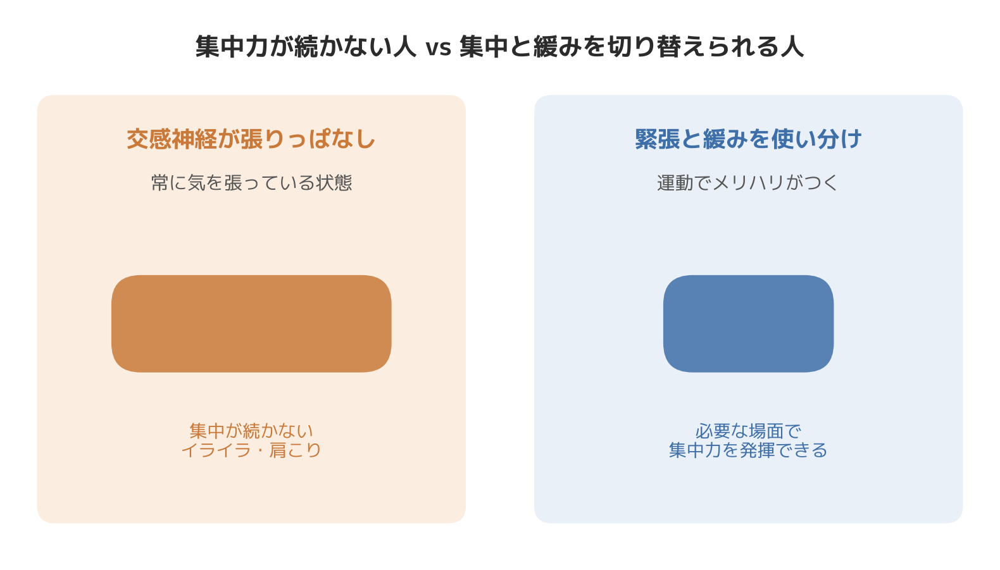

# 集中力低下が続くのはなぜか｜自律神経とパーソナルトレーニングの関係を整体師が解説

「午前中は普通に働けるのに、午後になると急に頭がぼんやりして、資料を読んでも内容が入ってこない」

以前担当していた30代・IT企業勤務の男性の会員さまが、まさにこの状態でした。デスクワーク中心で一日中座りっぱなし、移動といえば駅と自宅の往復だけ。本人いわく「集中力がないのは性格の問題だと思っていた」とのことでしたが、実際に体を触らせていただくと、首から肩、後頭部にかけての筋肉がかなり硬く、呼吸も浅くなっていました。こうした「仕事の集中力が続かない」という相談は、パーソナルトレーニングと整体の両方を担当している現場では珍しくありません。今日は柔道整復師・パーソナルトレーナーとして8年以上、体づくりと体のケアの両面に関わってきた立場から、「集中力低下」と「自律神経」「運動不足」の関係を整理してお話しします。

## 集中力は「自律神経の切り替え」の問題でもある

集中力というと脳の問題だと思われがちですが、実際には自律神経の状態と深く関わっています。自律神経には、活動時に優位になる交感神経と、休息時に優位になる副交感神経があり、この2つがバランスよく切り替わることで、人は必要な場面で集中し、必要な場面でしっかり休めるようになっています。

集中力を発揮するには交感神経が適度に働く必要がありますが、同時に副交感神経の働きも欠かせません。緊張状態が続きすぎると、かえって集中力が落ちてしまうことが知られています。つまり「ずっと気を張っている」状態は、集中力にとってむしろマイナスに働くということです。デスクワークで長時間同じ姿勢を取り続け、スマートフォンやPC画面を見続ける生活は、交感神経が優位な状態がだらだらと続きやすく、オンとオフの切り替えがうまくいかなくなる典型的なパターンだと感じています。

## 運動不足が集中力低下につながる理由

もう一つの切り口が、運動不足そのものです。身体活動や運動には、血流の促進やストレス緩和を通じてメンタルヘルスや生活の質を高める効果があることが知られており、集中力や作業効率とも無関係ではありません。

特に有酸素運動に関しては、脳の実行機能（目標に向かって行動や注意をコントロールする働き）を担う前頭前野の働きに良い影響を与えることが研究で示されています。日常的に体を動かす習慣がある人ほど、前頭前野の働き方が効率的になっていくという報告もあり、運動習慣が「集中できる脳の状態」を後押ししている可能性は十分にあると考えています。加えて、運動によって脳由来神経栄養因子(BDNF)と呼ばれる物質の働きが高まり、神経細胞の働きを支えることで学習や記憶に関わる機能を助けているということも分かってきています。

運動不足の状態が続くと、こうした脳の働きを支える仕組みが十分に刺激されないまま、交感神経だけが日常のストレスで張り続ける、という悪循環に陥りやすくなります。「体を動かしていないのに、頭ばかり使い続けている」状態こそが、集中力低下の正体の一つだというのが、トレーニング指導の現場で感じている実感です。

## SALUSの現場で見えてきたこと

柔道整復師として体の状態を見る視点と、パーソナルトレーナーとして体を動かす視点の両方を持っていると、集中力の相談に来られる方には、ある共通点があることに気づきます。それは、首の付け根から後頭部にかけての筋肉が常に張っていて、触診すると明らかにこわばっているのに、本人はそのこわばりに気づいていないケースが非常に多いということです。これは臨床上の実感ですが、こうした方に軽い有酸素運動と、首まわりの筋膜リリースを組み合わせてセッションを行うと、トレーニング後に「頭がすっきりした」「視界が開けた感じがする」という感想をいただくことが多くあります。運動単体でも、整体単体でもなく、体をほぐしてから動かす、あるいは動かした後にしっかり緩める、という組み合わせが、自律神経の切り替えを後押ししているのだと捉えています。

先ほどの会員さまも、トレーニングの中に軽いジョギング相当の有酸素運動と、肩甲骨まわりのリリースを取り入れたところ、1ヶ月ほどで「夕方の頭の重さが減った」と話してくださるようになりました。筋力トレーニングの負荷を上げたわけではなく、体を動かして緩める時間を生活の中に意図的に作ったことが変化につながったと感じています。もちろん感じ方には個人差があり、誰にでも同じ結果が出ると保証できるものではありません。

## 今日からできる具体策

- 1時間に1回は椅子から立ち上がり、肩をまわす・首を軽く倒すなど、1分でもいいので体を動かす
- 週に2〜3回、息が軽く弾む程度のウォーキングやジョギングを20〜30分取り入れる
- 作業の合間に深呼吸を意識し、吐く時間を長めに取ることで副交感神経への切り替えを促す
- 休憩時間はスマートフォンを見続けるのではなく、軽くストレッチをして体をほぐす時間に充てる
- 夜のトレーニングや運動の後は、クールダウンとして呼吸を整える時間を5分ほど確保する

## まとめ

仕事の集中力が続かないという悩みは、性格や気合いの問題として片付けられがちですが、実際には運動不足や自律神経のバランスの乱れが関係していることが少なくありません。交感神経が張りっぱなしの状態を、運動とケアの両方でほぐしてあげることが、集中力を取り戻す近道になると、8年の臨床とトレーニング指導の現場で感じています。まずは1日の中に「体を動かす」「緩める」の両方を意識的に取り入れることから始めてみてください。

─────────────

ここまで読んでくださった方へ

「集中力が続かない」を自律神経の視点から見直したい方へ。
東京23区に出張する、パーソナルトレーニング×整体のSALUS（セラス）。
自律神経の視点から体を整えたい方は、公式HPから初回体験のご予約が可能です（現在、体験料・入会金無料キャンペーン中）。

→ 公式HP：https://w-salus.com/

---

### 推奨タグ
#自律神経 #整体 #肩こり #睡眠 #パーソナルトレーニング #集中力
