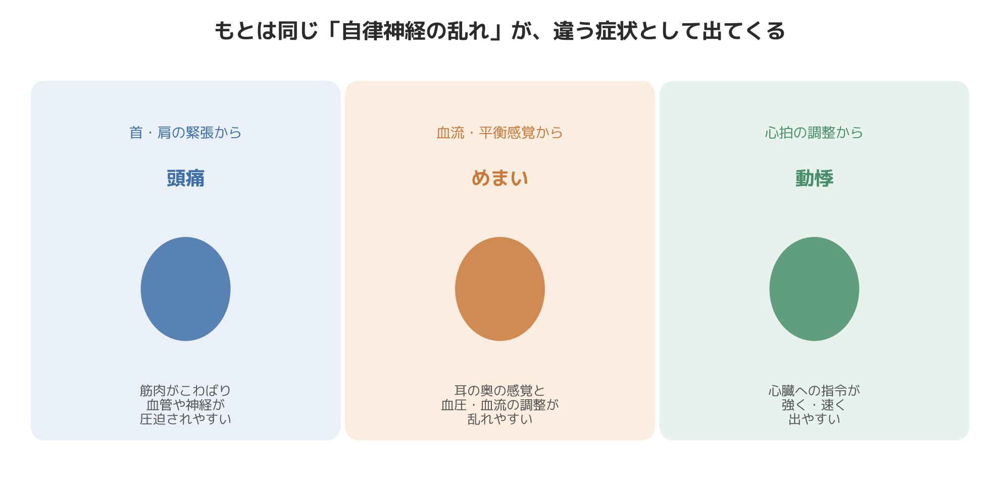

# 頭痛・めまい・動悸が続くあなたへ｜8年の現場相談でわかった自律神経とのつながり

「病院で検査を受けても、特に異常はないと言われた」「でも、頭痛やめまい、動悸がなくならない」——整骨院を8年経営し、その後パーソナルトレーナーとしても現場に立ってきた中で、こうした言葉を本当に何度も聞いてきました。

今日は、研究や理論の話からではなく、現場で実際にあった相談のパターンからお話ししたいと思います。頭痛・めまい・動悸という一見バラバラな症状が、なぜ同じ人に重なって出てくることが多いのか。8年間、体に向き合い続けてきたからこそ見えてきたことがあります。

## 「異常なし」と言われた方々によく出会う

ある時期、立て続けに似た相談を受けたことがあります。1人は40代の女性で、半年ほど前から朝起きると頭が重く、通勤電車の中で立ちくらみのようなめまいを感じることが増えていました。耳鼻科でも脳神経内科でも検査を受けましたが、「これといった異常は見当たらない」という結果だったそうです。それでも不調は続き、「気のせいと言われているようで辛い」と話してくれました。

もう1人は30代前半の男性で、会議中や電車で急に心臓がドクドクと速く打つ感覚に襲われることが続いていました。健康診断では心電図に異常はなく、医師からは「おそらくストレスによるものでしょう」とだけ説明を受けたと言います。本人としては、原因がはっきりしないまま「気にしすぎかもしれない」と自分を責めてしまっている様子でした。

このお二人は別々の時期に来院された方ですが、共通していたのは「検査で異常が見つからない不調」を抱えていたこと、そして「原因が分からないまま我慢していた期間が長い」ことでした。こうしたケースは、この8年間で決して珍しいものではなく、むしろ頭痛・めまい・動悸の相談の中でもかなりの割合を占めている印象があります。

## 現場で見えてきたこと——体を見ると、共通する特徴がある

このお二人の体を実際に触れて確認すると、驚くほど共通点がありました。首の付け根から後頭部にかけての筋肉が板のように硬くなっていること、肩甲骨まわりの動きが乏しいこと、そして呼吸が浅く、胸の上の方だけでしか息をしていないことです。

これは臨床上の実感ですが、頭痛・めまい・動悸を訴えて来られる方の多くに、後頭部から首の付け根にかけての深い部分の筋肉（検査画像にはあまり映らない層）の慢性的な緊張が見つかります。この部分には自律神経の通り道となる血管や神経が集まっており、ここが硬くこわばっていると、頭部への血流や神経の伝達になんらかの影響が出やすいのではないかと、施術者としては感じています。病院の検査で異常が出にくいのは、骨や大きな血管、心臓そのものに器質的な問題がなく、あくまで「筋肉の緊張」と「自律神経のバランス」というソフトな部分の不調だからではないか、というのが8年間現場に立ってきた中での実感です。

もう一つ、現場で意外と多いと感じるパターンがあります。それは、頭痛やめまい、動悸のどれか1つだけを訴えて来院される方でも、よく聞いていくと実は他の症状も併発しているケースです。「めまいだけだと思っていたけれど、言われてみれば頭も重い」「動悸のことで悩んでいたが、実は立ちくらみも時々ある」という具合です。それぞれ別の不調だと思っていたものが、根っこでは同じ状態から出てきている可能性がある、というのが現場で繰り返し見てきた光景です。

## なぜ頭痛・めまい・動悸が重なって出やすいのか

自律神経は、心臓の拍動や血管の収縮・拡張、呼吸、消化など、体のほとんど全ての器官を無意識のうちにコントロールしている神経です。ストレスや緊張が続くと交感神経が優位になりやすく、この状態が慢性化すると、首や肩の筋肉の緊張、血流や血圧の調整、心拍のコントロールなど、複数の場所に同時に影響が出てくることが知られています。

緊張型の頭痛は、長時間のデスクワークなどによる筋肉のこわばりに加えて、ストレスによる自律神経の変調が血管や神経への影響に関わっていると言われています。めまいについても、耳の奥にある平衡感覚の器官そのものに問題がなくても、自律神経の乱れによって血流や血圧の調整がうまくいかず、ふらつきや立ちくらみとして現れることがあると言われています。動悸も同様に、交感神経が優位になることで心拍数を上げるよう心臓に指令が送られ続け、本人は安静にしているつもりでも心臓だけが先に反応してしまう、という状態が起こり得ます。

つまり、頭痛・めまい・動悸は、原因の臓器こそ違って見えますが、「自律神経の乱れ」という共通の土台から枝分かれして出てきている症状、と捉えることができます。これは私がこれまで臨床の現場で繰り返し見てきた実感とも一致しています。

ただし、ここで一つ強調しておきたいことがあります。頭痛・めまい・動悸は、脳や心臓、耳など重大な病気が隠れているサインである可能性もゼロではない症状です。症状が急に強く出た場合や、繰り返し続く場合、しびれや意識が遠のく感覚を伴う場合などは、自己判断せずにまず医療機関を受診し、他の病気の可能性が否定された上で、生活や体のケアを見直していくという順番を大切にしてください。

## 今日からできること

- 1日の中で、後頭部から首の付け根を自分の手で軽く触れ、硬くなっていないか確認する習慣をつける
- 1時間に1回、肩をすくめて脱力する、首をゆっくり左右に倒すなど、小さな動きを挟む
- 胸だけでなくお腹も動かす呼吸を、1日数回、意識的に行う
- 就寝前はスマートフォンの画面から離れ、体が休息モードに入りやすい時間をつくる
- 症状が強い・長引く・悪化している場合は、我慢せずまず医療機関で検査を受ける

## まとめ

頭痛・めまい・動悸は、別々の悩みとして語られがちですが、現場で多くの方の体を見てきた中では、根っこに同じ「自律神経の乱れ」と「体の慢性的な緊張」が隠れていることが少なくありません。病院で検査を受けても異常が見つからず、不安な気持ちのまま過ごしている方には、体の緊張という視点から自分の状態を見直してみることを一つの選択肢として知っておいてほしいと思います。もちろん、まず医療機関で重大な病気の可能性を確認した上で、という前提は忘れずにいてください。

─────────────

ここまで読んでくださった方へ

頭痛・めまい・動悸が続き、「検査では異常がない」と言われて困っている方へ。
東京23区に出張する、パーソナルトレーニング×整体のSALUS（セラス）。
自律神経の視点から体を整えたい方は、公式HPから初回体験のご予約が可能です（現在、体験料・入会金無料キャンペーン中）。

→ 公式HP：https://w-salus.com/

---

### 推奨タグ
#自律神経 #整体 #肩こり #睡眠 #パーソナルトレーニング #頭痛 #めまい
